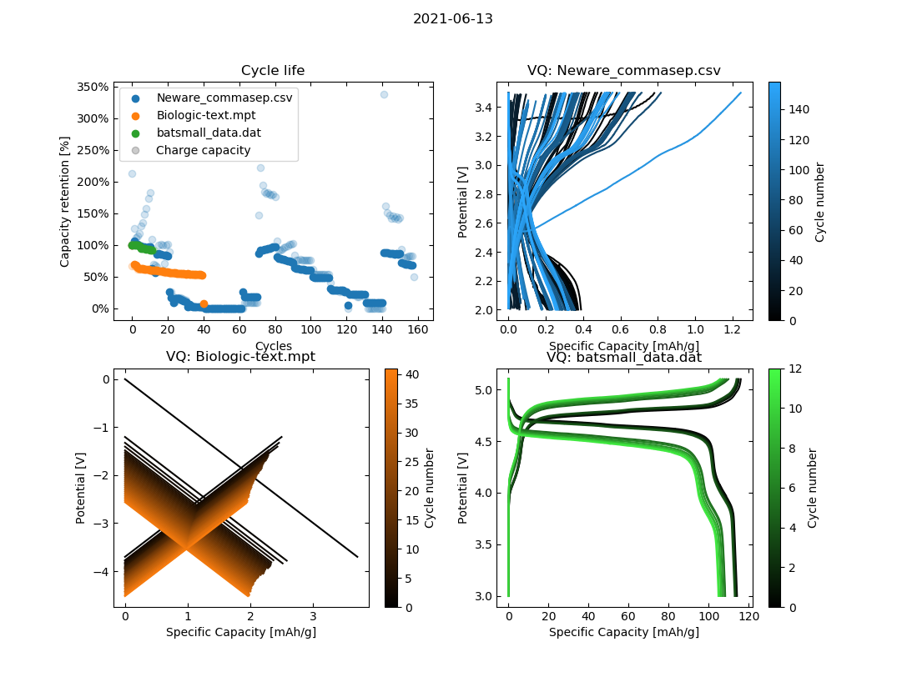
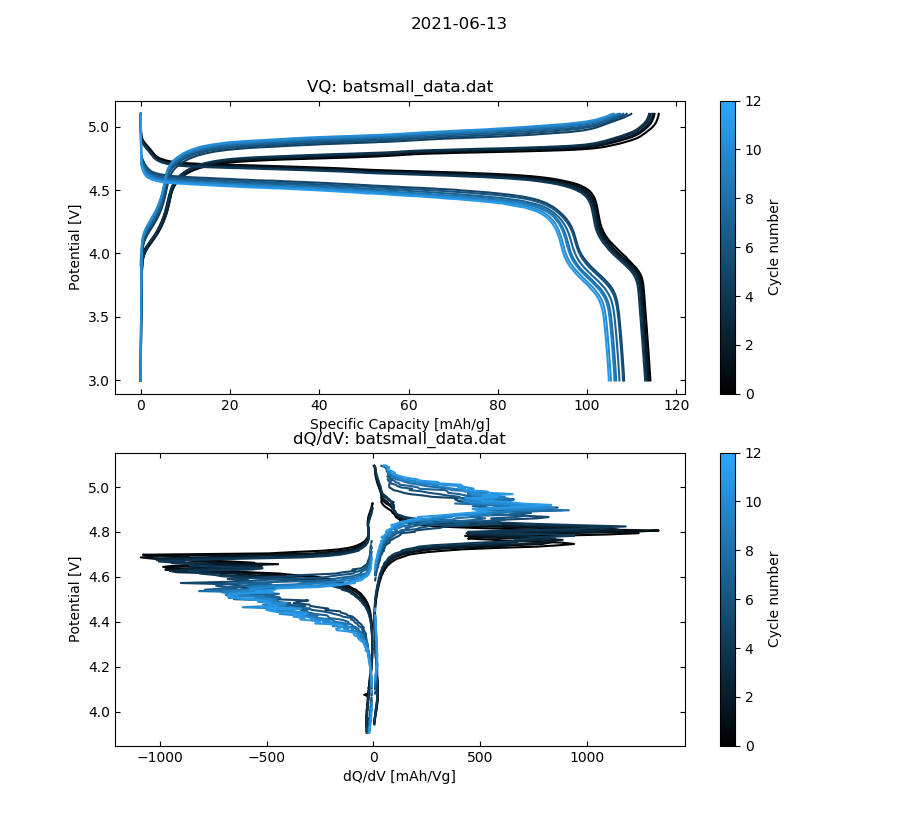
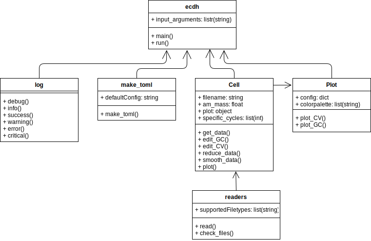

# [OBSOLETE] ecdh - ElectroChemical Data Handling

**THIS PACKAGE HAS BEEN OBSOLETED IN FAVOUR OF [SciBatt](https://github.com/amundmr/SciBatt)**

edch provides easy solutions for simple handling of electrochemical data. Most emphasis is so far put on how to display the data using matplotlib.


## Installation

ecdh is hosted on pypi, and can be installed via pip by:
```pip install ecdh```


## Usage:

run ```ecdh```.

Command line arguments:

- **init** initializes a toml file with the name *ecdh.toml*. Any supported datafiles in the local directory will be added to it.
- **run config.toml** runs with the configuration set in config.toml

Example use:
```
ecdh
ecdh init
ecdh run config.toml
```


## Features:

- Galvanostatic Cycling
    - Plot Charge/Discharge curves over cycle life
        - Range, specific or all cycles can be plotted in addition to trimming of the first *x* cycles.
    - Plot Capacity retention over cycle life
    - Plot dQ/dV
    - Plot data from any number of input files
- Cyclic Voltammetry


## Supported Input filetypes:

- Biologic (.mpt)
- BatSmall (.txt)

Coming:

    - Neware backup files (.xlsx)
    - Neware export as general report (.csv)


## Dependencies
Standard Packages:
- os
- sys
- datetime
- math
- inspect
- shutil

Custom Packages:
- Matplotlib
- Numpy
- Scipy
- Pandas
- toml


## Examples

I have three datafiles from different equipment, but since they are all in the same folder, I can initiate a config file with the *init* command, and run it afterwords with *run ecdh.toml*.

The terminal looks like:

```
$ ecdh init
[INFO] Wrote example configuration to 'ecdh.toml' with 3
files found
$ ecdh run ecdh.toml 
[INFO] Reading file: 'Neware_commasep.csv'
[INFO] Reading file: 'Biologic-text.mpt'
[INFO] Active mass found in file to be: 1e-06g
[INFO] Datafile ended with a Discharge
[INFO] Reading file: 'batsmall_data.dat'
```

Which yields the following output:


If I now enter the *ecdh.toml* file and set *dqdvplot = true*, *qcplot = false* and remove the entry of the ugly files, The output is:



## TODO list

- Enable specific cycles on a per-file basis
- Add Withaker-despiker smoothing algorithm to dQ/dV data
- Make dQ/dV and V/Q plot in the same figure if both are to be plotted
- Fix Neware general report .csv reader

# Program structure

## Flowchart



## SubModules

**readers**

Functions:

- Read(): Takes a filepath and returns a dataframe with eventual metadata
    - Dataframe headers: ['mode', 'time/s', 'Ewe/V', '\<I>/mA', 'cycle number']
- Internal functions:
    - BioLogic: read_MPT()
    - Neware: read_xlsx(), read_csv()
    - Batsmall: read_txt()

**cell**

Contains the Cell class with functions:

- get_data():   Runs readers.read(filename)
- edit_data(): Runs any of the internal functions according to the cfg.toml and what experiment type the file is.
- Internal functions:
    - _edit_cyclelife(): Edits data for easy cyclelife plotting
    - _edit_CV(): Edits data for easy cyclic voltammetry plotting
    - _edit_GC(): Edits data for easy galvanostatic cycling plotting
    - _edit_dQdV(): Edits data for easy dQdV plotting

**plot**

Contains the Plot class with functions:

- plot(): Takes list of cell objects as input parameter, reads the cfg.toml and plots it all according to that.
